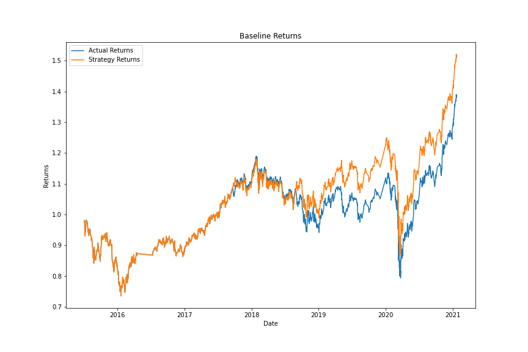
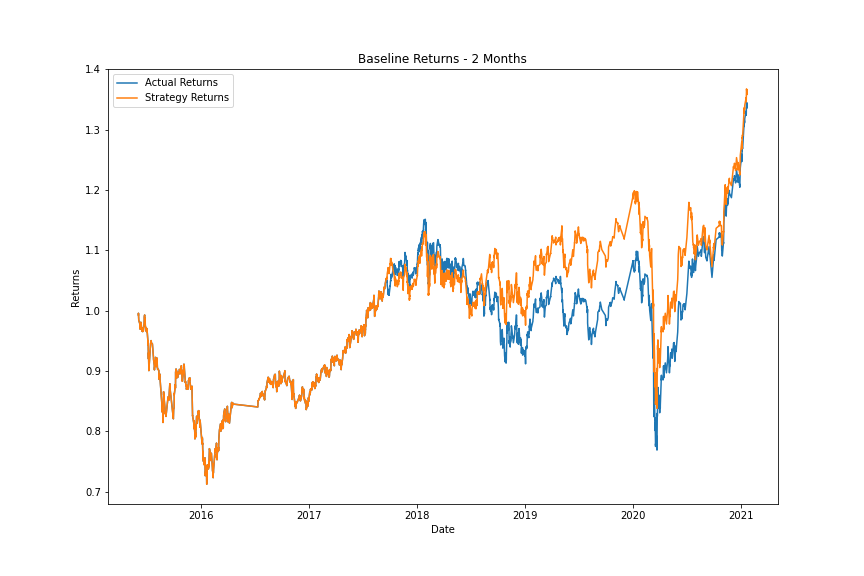
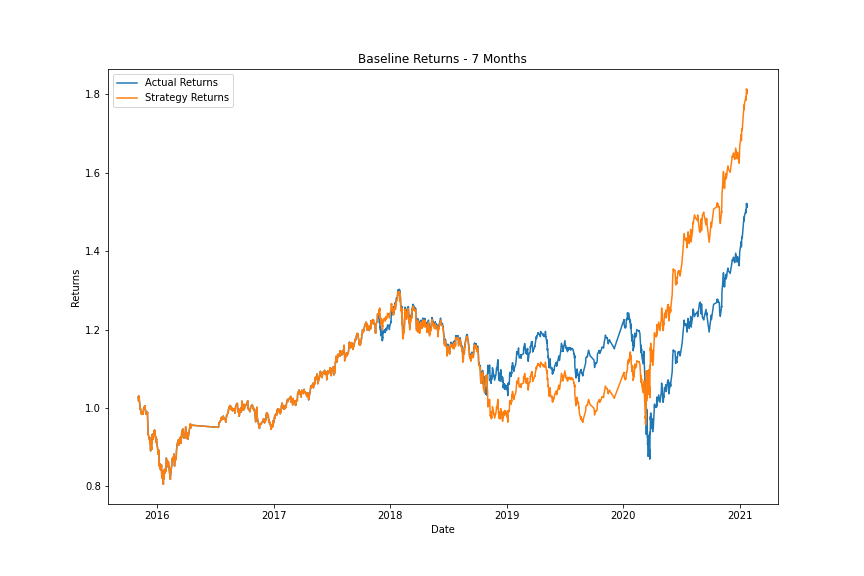
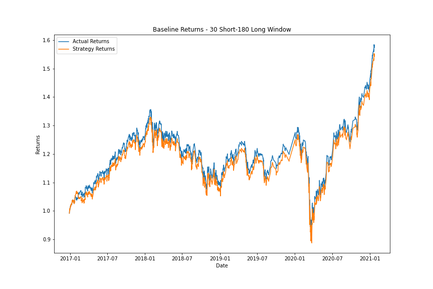
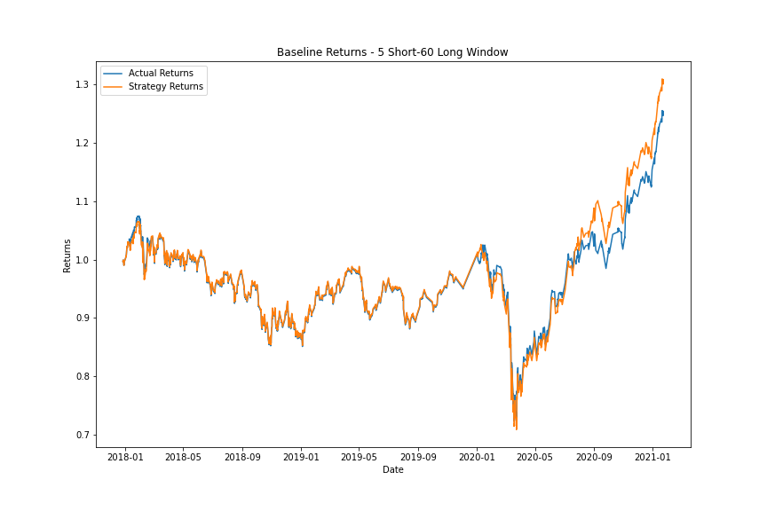
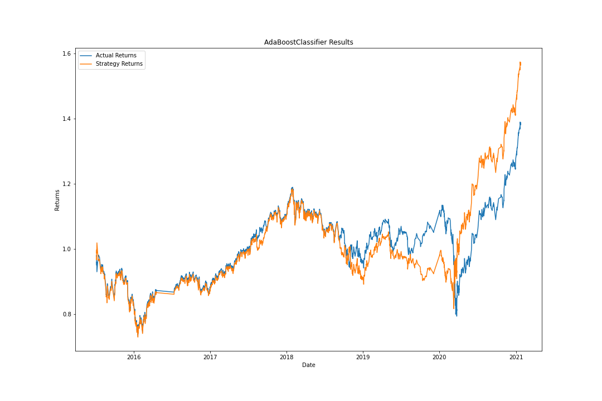

# Trading_Using_Machine_Learning
This script combines algorithmic trading with financial Python programming and machine learning to create an algorithmic trading bot that learns and adapts to new data and evolving markets.

---

## Trading Prediction Analysis: 
 
### Tuning the Baseline Trading Algorithm
* Slicing data into different periods:

### Baseline Predictions: 
#### Slow SMA window = 4 / Fast SMA window = 100 / Training Data Window = 3 months



### 2 Month Slice Predictions:
#### Slow SMA window = 4 / Fast SMA window = 100 / Training Data Window = 2 months



### 7 Month Slice Predictions:
#### Slow SMA window = 4 / Fast SMA window = 100 / Training Data Window = 7 months



### Question/Answer:
### What impact resulted from increasing or decreasing the training window?
#### 2 month slice:

Decreasing the training window to 2 months did not have any significant impact on the results. The accuaracy remained at 55% and the recall values did not change. The precision value however for a sell position decreased from 43% to 39%

#### 7 Month slice:

Increasing the training window to 7 months did increase the accuracy 1% from 55% to 56%. The recall value for a buy postition decreased by 1% from 96% to 95% and for the sell position increased by 1% from 4% to 5%. The precision value for the buy position stayed the same however for the sell position it increased by 2% from 43% to 45%. 

We do see an improvment in the prediction model by increasing the training window to 7 Months.

---
## Tuning the trading algorithm by adjusting the SMA input features. 
* Adjusting one or both of the windows for the algorithm.

### Slow SMA window = 30 / Fast SMA window = 180 / Training Data window = 3 months:



### Slow SMA window = 5 / Fast SMA window = 60 / Training Data window = 3 months:



### Question/Answer:
### What impact resulted from increasing or decreasing either or both of the SMA windows?

#### Slow SMA window = 30 / Fast SMA window =  180 / Training Data window = 3 Months
Increasing both the slow and fast SMA windows to 30days and 180days respectfully, increased the accuracy by 1%. The recall value for a buy postition increased by 2% from 96% to 98% though for the sell position it decreased by 2% from 4% to 2%. The precision values for both the buy and sell positions stayed the same.

#### Slow SMA window = 5 / Fast SAM wondow = 60 / Training Data window = 3 Months
Increasing the slow SMA to 5 days and decreasing the fast SMA to 60days, did not change the accuracy compared to the baseline model. Though we do see changes in the recall and precision. The recall for the sell position decreased by 2% from 4% to 2% and increased for the buy position by 1% from 96% to 97%. The precision saw decreases in both buy and sell positions with the sell position seeing a decrease by 3% from 43% to 40% and the sell position by 1% from 56% to 55%.

With these results we can see that it does not benifit us to increase or decrease the SMA windows

---
## The set of parameters that best improved the trading algorithm returns:

### 7 month Training Data window 


---
## Backtest the new model to evaluate its performance:
### Using AdaBoost Classifier




### Question/Answer: 
#### Did this new model perform better or worse than the provided baseline model? 

Though the recall in the buy postion for this model dropped 4% from 96% to 92% we did see an increase in the recall for the sell position by 4% from 4% to 8%. I see this as an imporovement as it can better predict when to sell.
#### Did this new model perform better or worse than your tuned trading algorithm?

This model did preform better than the tuned trading algorithm other than the tuned 7month Training Data window that we created.

---
### Evaluation Report:

* Increasing the training data window to 7 months allows the model to increase in accuarcy and seems to prodive the best prediction model. However further increasing in the training window may lead to overfitting.

* Decreasing the training data window does not have a very significant effect on the trading results.

* Increasing the Slow SMA window to 5 days leads to completely eliminating the precision of sell and buy signals. So this parameter change is undesirable.

* Increasing both the slow and fast SMA windows to 30days and 180days respectfully, increased the accuracy by 1% but is unable to predict a sell signal well enough to make it worth using.

* The AdaBoost Classifier performs better with the baseline dataset, other than the 7 month tuned Training Data window. 


---
## Technologies

This program runs on [Python 3.7](https://www.python.org/) and utilizes:
* [Jupyter Lab](https://jupyter.org/install)
* [Pandas](https://pandas.pydata.org/)
* [numpy](https://numpy.org/)
* [sklearn](https://scikit-learn.org/stable/)
* [hvplot](https://pyviz-dev.github.io/hvplot/)

---
## Installation Guide

The dependencies needed to run the program:

```python
import pandas as pd
import numpy as np
from pathlib import Path
import hvplot.pandas
import matplotlib.pyplot as plt
from sklearn import svm
from sklearn.preprocessing import StandardScaler
from pandas.tseries.offsets import DateOffset
from sklearn.metrics import classification_report
```

---
## Usage

To utilize the machine learning trading program, open `machine_learning_trading_bot.ipynb` in Jupyter Lab 

---
## Contributors

Thomas Leahy, thomasleahy6@gmail.com

Starter Code provided by © 2020 - 2021 Trilogy Education Services, a 2U, Inc. brand.

---
## Licence
MIT Licence

2022 Thomas Leahy
